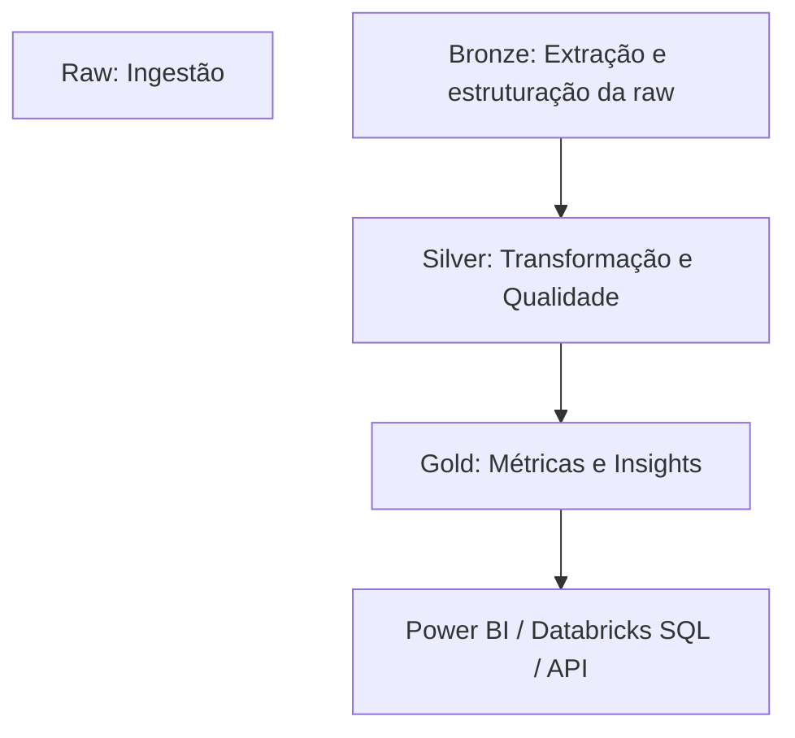

# 🏗️ Lakehouse - Camadas Bronze, Silver e Gold (Databricks DLT)

## 📘 Visão Geral
Pipeline de dados construído no **Databricks Delta Live Tables (DLT)**, organizado nas camadas **Bronze → Silver → Gold**, garantindo ingestão contínua, qualidade e geração de insights de negócio.

---

## 🪙 Camada Bronze — Ingestão Bruta
Responsável pela **ingestão raw** e armazenamento fiel das fontes originais.

### Principais Pontos
- Tipo: `CREATE OR REFRESH STREAMING LIVE TABLE`
- Fontes: `cloud_files(...)` e `STREAM(...)`
- Incremental com **schema evolution**

### Tabelas
| Tabela                     | Fonte                                                               | Descrição                |
|---------------------------|---------------------------------------------------------------------|--------------------------|
| `bronze.bitcoin`          | `/Volumes/lakehouse/raw/coinbase/bitcoin_spot/`                     | Dados brutos Bitcoin     |
| `bronze.yfinance`         | `/Volumes/lakehouse/raw/yfinance/commodities/latest_prices/`        | Commodities via yFinance |
| `bronze.customers`        | `raw_public.customers`                                              | Dados de clientes        |
| `bronze.sales_btc`        | `raw_public.sales_btc`                                              | Vendas de Bitcoin        |
| `bronze.sales_commodities`| `raw_public.sales_commodities`                                      | Vendas de commodities    |

---

## 🥈 Camada Silver — Transformação e Qualidade
Aplica **limpeza, padronização e validação** dos dados vindos da Bronze com **Data Quality Expectations**.

### Objetivos
- Padronizar tipos e símbolos
- Garantir integridade e consistência
- Aplicar regras de negócio intermediárias

### Tabelas
| Tabela                          | Fonte                 | Descrição                              |
|---------------------------------|-----------------------|----------------------------------------|
| `silver.fact_transaction_assets`| BTC + Commodities     | União e padronização de transações     |
| `silver.fact_quotation_assets`  | BTC + yFinance        | União e padronização de cotações       |
| `silver.dim_clientes`           | Customers             | Dimensão de clientes anonimizada       |
| `silver.fact_transaction_revenue`| Fatos + Dimensões    | Cálculos de receita e taxas            |

### Qualidade e Segurança
- `EXPECT quantidade > 0`, `EXPECT preco > 0`
- Anonimização: `SHA2(documento, 256)`
- Governança: **Unity Catalog** + Lakeflow Lineage

---

## 🥇 Camada Gold — Métricas e Insights
Consolida as informações de negócio e gera **KPIs e rankings** para análise.

### Objetivos
- Agregar métricas financeiras
- Classificar e ranquear clientes
- Expor dados prontos para BI e dashboards

### Tabelas
| Tabela                    | Fonte                           | Descrição                         |
|---------------------------|----------------------------------|-----------------------------------|
| `gold.mostvaluableclient` | `silver.fact_transaction_revenue`| Métricas e segmentação de clientes|

### Métricas
- Total e valor de transações
- Ticket médio
- Primeira e última transação
- Transações nos últimos 30 dias
- Receita de taxas (0,25%)
- Ranking por volume (`RANK() OVER`)

---

## ⚙️ Boas Práticas
- Orquestração: Delta Live Tables  
- Qualidade: `EXPECT ... ON VIOLATION DROP ROW`  
- Auditoria: `ingestion_ts_utc`, `calculated_at`  
- Governança: Unity Catalog  
- Performance: processamento incremental  

---

## 🔄 Fluxo Geral

---

## 🧩 Stack Técnica
| Categoria     | Ferramenta              |
|---------------|-------------------------|
| Ingestão      | CloudFiles, STREAM      |
| Transformação | Databricks DLT          |
| Armazenamento | Delta Lake              |
| Qualidade     | Data Quality Expectations |
| Governança    | Unity Catalog           |
| Visualização  | Power BI, Databricks SQL|
